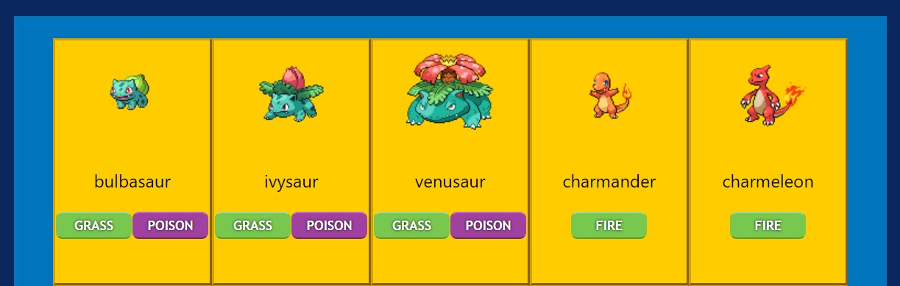

<h1 align="center"> Xininhodex </h1>
<a href="https://heronbaruch.github.io/Xininhodex/">
  

    
  
 
</a>

Projeto utilizando as tecnologias de desenvolvimento (React.js, JavaScript, CSS, HTML), assim como requisições em API e implementações de páginas dinâmicas as quais tem links baseados em variáveis (nomes do pokemon), oque torna possível também buscar além dos 150 pokemon's iniciais aos quais estão disponíveis na página inicial, mudando o nome do pokemon pelo NOME ou ID de qualquer outro pokemon, sera buscado na API e retornara as informações do mesmo.
